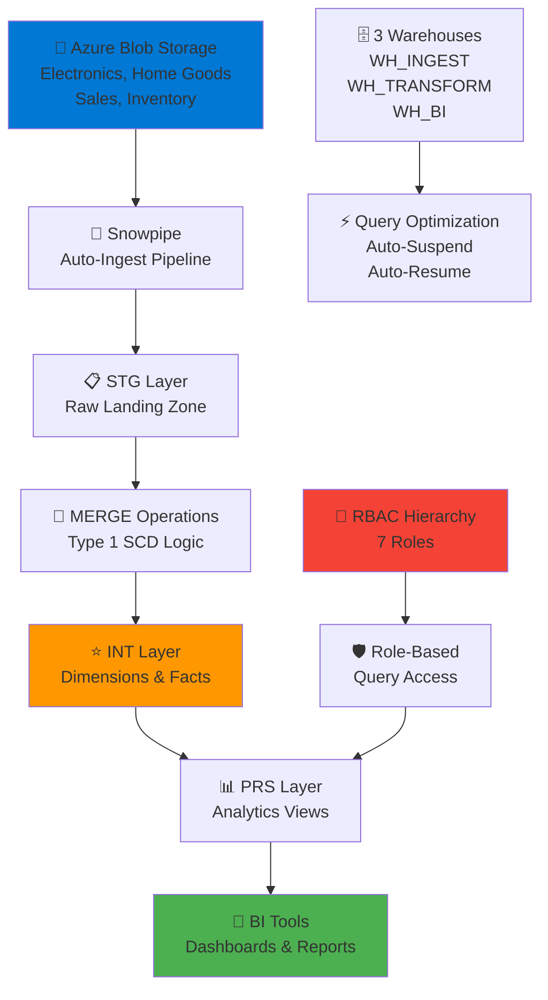

# 🏪 Chroma Retail Data Platform

> **Enterprise-scale data warehouse powered by Snowflake and Azure for real-time retail analytics**

[](https://www.snowflake.com/)
[](https://azure.microsoft.com/)
[](https://www.snowflake.com/)
[](https://docs.snowflake.com/)

## 🎯 Overview

A **production-grade data warehouse** transforming Chroma's retail operations across electronics, home goods, and more. Built with Snowflake + Azure, featuring automated ETL pipelines, dimensional modeling, and enterprise governance for real-time retail intelligence.

### ✨ Key Features

- **🔄 Automated ETL Pipelines** - Snowpipe for real-time data ingestion from Azure Blob Storage
- **📊 Star Schema Design** - Dimensional modeling with facts and conformed dimensions
- **☁️ Cloud-Native Architecture** - Snowflake data cloud with unlimited scalability
- **🔒 Enterprise RBAC** - 7-tier role-based access control with data governance
- **📈 Advanced Analytics** - Real-time KPIs, inventory management, customer lifetime value
- **⏱️ Time Travel & Recovery** - Data versioning with point-in-time restore capabilities
- **💾 Massive Scale** - Handles millions of daily transactions across 6 core entities

## 🏗️ Architecture



## 🛠️ Technical Stack

### **Data Platform**
- **❄️ Snowflake** - Enterprise data warehouse with multi-cluster architecture
- **☁️ Azure** - Blob storage + Queue integration for seamless pipelines
- **🚀 Snowpipe** - Continuous data ingestion with auto-ingest notifications
- **📊 Time Travel** - Version control for data with 1-14 day retention

### **Data Architecture**
- **🏛️ 3-Layer Medallion** - STG → INT → PRS for data quality progression
- **⭐ Dimensional Modeling** - 4 conformed dimensions + 2 fact tables
- **🔄 Type 1 SCD** - MERGE-based dimension updates with upsert logic
- **🗂️ Schema Governance** - Enforced naming conventions and constraints

### **Security & Governance**
- **🔐 RBAC System** - Admin, Engineer, Pipeline, Analyst, Power User, Auditor, Support roles
- **🛡️ Row & Column Security** - Granular access controls at schema/object level
- **📜 Audit Trail** - Query history and data lineage tracking
- **🔑 Storage Integration** - Azure AD authentication with secure credentials

## 📊 Data Model

### **Dimension Tables**
| Table | Records | Purpose |
|-------|---------|---------|
| `DIM_PRODUCT` | 10K+ | Product catalog with attributes |
| `DIM_CUSTOMER` | 100K+ | Customer profiles & loyalty tiers |
| `DIM_STORE` | 500+ | Store locations & formats |
| `DIM_EMPLOYEE` | 50K+ | Employee directory & roles |

### **Fact Tables**
| Table | Records | Volume |
|-------|---------|--------|
| `FACT_SALES` | 50M+ | Daily transactions & metrics |
| `FACT_INVENTORY` | 1M+ | Inventory snapshots by store/product |

## 🚀 Quick Start

### Prerequisites
- Snowflake account (Standard or higher)
- Azure subscription with Blob Storage
- SQL client (Snowflake Web UI, DBeaver, VSCode)

### Setup

```bash
# 1. Configure Azure integration
AZURE_TENANT_ID = 'your-tenant-id'
STORAGE_ALLOWED_LOCATIONS = 'azure://container.blob.core.windows.net/path/'

# 2. Create Snowflake objects
-- Run Chroma_queries.sql in sequence:
-- - Warehouses (WH_INGEST, WH_TRANSFORM, WH_BI)
-- - Database & Schemas (STG, INT, PRS)
-- - Storage Integration & Stages
-- - File Formats & Pipes

# 3. Monitor Snowpipe
SELECT SYSTEM$PIPE_STATUS('P_PRODUCT');
SELECT SYSTEM$PIPE_STATUS('P_SALES');

# 4. Query analytics
SELECT * FROM CHROMA.PRS.VW_SALES_DAILY_STORE_PRODUCT;
```

## 📈 Analytics & KPIs

### **Pre-built Views**
- **📊 VW_SALES_DAILY_STORE_PRODUCT** - Daily sales by location, product, category
- **📦 VW_INVENTORY_ONHAND_BY_STORE** - Real-time inventory levels with reorder points
- **👥 VW_CUSTOMER_LIFETIME_VALUE** - CLV analysis with order history
- **📋 VW_PRODUCT_CATALOG** - Product hierarchy for BI filtering

### **Key Metrics**
```sql
-- Month-over-Month Sales Growth
MoM Change: Calculate % growth in net sales vs prior month

-- Top 50 Products
By quantity sold, net sales, and margin

-- Store Performance
Highest/lowest performing locations by revenue

-- Inventory Analysis
Stores with excess inventory (high on-hand vs 30-day sales)
```

## 🔐 Security & RBAC

### **Role Hierarchy**
```
CHROMA_ADMIN (inherit all)
├── CHROMA_ENG (transform & model)
├── CHROMA_PIPE (ingestion rights)
├── CHROMA_ANALYST (PRS layer read)
├── CHROMA_POWER_USER (INT + PRS read)
├── CHROMA_AUDITOR (audit & compliance)
└── CHROMA_SUPPORT (pipe monitoring)
```

### **Governance Features**
- **✅ Warehouse segregation** - Separate resources for ingest/transform/analytics
- **📋 Schema-level RBAC** - Different permissions per layer
- **🔍 Future object grants** - Automatic permissions for new tables/views
- **📊 Audit views** - Query access logs and data modification tracking

## 📁 Project Structure

```
chroma-retail-data-platform/
├── query/
│   └── Croma_queries.sql    # Complete DDL & DML (1000+ lines)
│       ├── Warehouse config (3 warehouses)
│       ├── Database & schemas (STG, INT, PRS)
│       ├── Dimension tables (4 entities)
│       ├── Fact tables (2 tables)
│       ├── MERGE operations (upsert logic)
│       ├── Analytical views (4 views)
│       ├── KPI queries (store performance, inventory)
│       ├── RBAC setup (7 roles + grants)
│       ├── Time travel configuration
│       └── Data recovery procedures
└── README.md
```

## 🌟 Advanced Features

### **Time Travel & Recovery**
```sql
-- Point-in-time restore
SELECT * FROM FACT_SALES AT (TIMESTAMP => '2025-09-15'::timestamp);

-- Data rescue with table cloning
CREATE TABLE FACT_SALES_RESCUE CLONE FACT_SALES AT (TIMESTAMP => '...');
ALTER TABLE FACT_SALES SWAP WITH FACT_SALES_RESCUE;

-- Configurable retention
ALTER SCHEMA CHROMA.INT SET DATA_RETENTION_TIME_IN_DAYS = 14;
```

### **Performance Optimization**
- **⚡ Auto-Suspend** - Warehouses pause after 60 minutes of inactivity
- **🔄 Auto-Resume** - Automatic startup on query submission
- **📊 Clustering Keys** - Optimized joins on dimensional keys
- **💾 Dynamic Pricing** - Cost-efficient scaling based on workload

### **Data Quality**
- **🔗 Foreign key constraints** - Referential integrity (not enforced, logged)
- **✅ NOT NULL validation** - Critical field enforcement
- **📏 Data type consistency** - Strict schema adherence
- **🔄 Idempotent operations** - Safe re-runs with MERGE logic

## 📊 Scale & Performance

- **💾 Data Volume** - 50M+ sales transactions, 1M+ inventory records
- **📈 Daily Load** - Automated Snowpipe ingestion
- **⚡ Query Speed** - Sub-second response times on dimensional queries
- **🚀 Scalability** - Unlimited compute resources on-demand

## 🎯 Real-world Use Cases

- **📊 Executive Dashboards** - Real-time sales, inventory, and margin analytics
- **📦 Inventory Optimization** - Identify overstock and reorder requirements
- **👥 Customer Analytics** - Loyalty tier analysis and CLV predictions
- **🏪 Store Operations** - Performance benchmarking across locations
- **💼 Supply Chain** - Inventory-to-sales ratios for demand planning

## 🚀 Future Enhancements

- [ ] **🤖 ML Integration** - Demand forecasting models in Snowpark
- [ ] **📱 Real-time Dashboards** - Streamlit/Power BI integration
- [ ] **🌍 Multi-region** - Replication across geographies
- [ ] **📊 Advanced Analytics** - Cohort analysis and attribution modeling
- [ ] **🔔 Alerts** - Automated anomaly detection and notifications
- [ ] **🔗 Data Sharing** - Secure data exchange with vendors/partners

## 🤝 Contributing

Contributions welcome! Focus areas:
- **📈 Additional KPIs** - Custom metrics and analytical views
- **🔧 Query Optimization** - Performance tuning and materialized views
- **📊 Data Governance** - Enhanced audit logging and compliance
- **🎯 Feature Expansion** - New fact/dimension tables or entities

## 📄 License

MIT License - See [LICENSE](LICENSE) for details.

---

**Enterprise data warehousing at scale with Snowflake** ❄️📊
